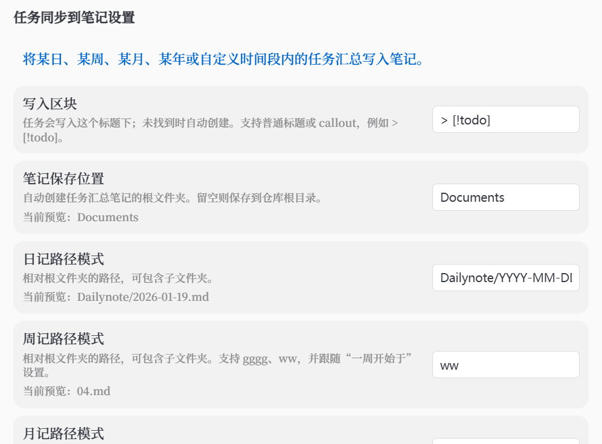
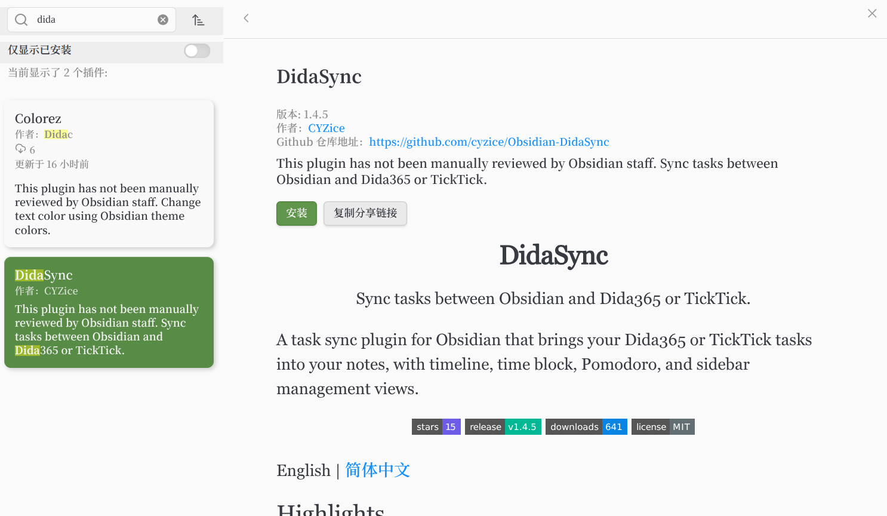

<h1 align="center">DidaSync</h1>

<p align="center"><b>Sync tasks between Obsidian and Dida365 or TickTick.</b></p>

<p align="center">

A task sync plugin for Obsidian that brings your Dida365 or TickTick tasks into your notes, with timeline, time block, Pomodoro, and sidebar management views.

</p>

<p align="center"><a href="https://github.com/CYZice/Obsidian-DidaSync/stargazers">


</a>

<a href="https://github.com/CYZice/Obsidian-DidaSync/releases/latest">


</a>

<a href="https://github.com/CYZice/Obsidian-DidaSync/releases">


</a>

<a href="https://github.com/CYZice/Obsidian-DidaSync/blob/main/LICENSE">


</a>

</p>

<p align="center">

<b>English</b> | <a href="./README_ZH.md">简体中文</a>

</p>

## Why DidaSync

- Faster sync: keep tasks synchronized between Obsidian and Dida365 / TickTick.
- More native visualization: manage work with sidebar, time block, timeline, and Pomodoro views.
- Smarter task workflows: use native task sync, task-to-note export, Markdown backlinks, and optional MCP integration.

## Product Overview

| Time Block View | List View |
|:--:|:--:|
|  |  |
| Schedule and drag tasks by day. | Review progress and deadlines quickly. |

## Core Capabilities

| Capability | Description |
|---------|-------------|
| 🔄 **Two-way Sync And Native Task Flow** | Sync task status, content, and details between Obsidian and Dida365 / TickTick, and create or update tasks from native `- [ ]` syntax. |
| 🗓️ **Multi-view Task Management** | Use sidebar, time block, timeline, and Pomodoro views for planning, execution, and review. |
| 🌲 **Task Structure Management** | Organize tasks with nested subtasks, drag reordering, drag-to-parent nesting, and cross-project moves. |
| ✅ **Completed Task Review** | View completed tasks by time range to support reviews, reporting, and summaries. |
| 📝 **Note Integration** | Drag tasks into Markdown, sync tasks into notes, and jump back from note links to the related task. |
| 🤖 **MCP / AI Integration** | Optionally expose a local MCP service so AI tools can read, create, update, and schedule tasks. |

## Quick Start

1. [Install and enable the plugin](#installation).
2. Open plugin settings and complete OAuth authorization for your Dida365 or TickTick account.
3. Open the sidebar or use the ribbon icon to start syncing tasks.
4. On mobile, if the browser cannot return to the local callback page automatically, finish authorization by copying the returned `code` back into the plugin.

## Common Workflows

### 1. Use Native Obsidian Task Syntax `- [ ]`

1. Enable **Settings -> DidaSync -> Sync Settings -> Enable Native Task Sync**.
2. Type native Obsidian task syntax such as `- [ ] ` in a Markdown document.
3. DidaSync opens an action menu for creating, linking, or enriching the task with dates and details.
4. After sync, the line gets a Dida link appended, and later checking `- [x]` can also update the remote task status.

### 2. Organize Nested Subtasks And Drag Structure

1. Expand a parent task in the sidebar task list.
2. Drag a task above or below another task to reorder it.
3. Drag a task under a parent task to turn it into a nested subtask.
4. Drag a task onto another project header or container to move it across projects.

Organize complex task structures more naturally inside Obsidian and sync the result back to Dida365 or TickTick.

### 3. Sync Tasks To Notes

1. Open **Settings -> DidaSync -> Sync Settings -> Task Note Sync Settings**.
2. Set the target block, note folder, week start day, and whether to query remote tasks before writing.
3. Open the command palette and run `Sync tasks to note`.
4. Choose a day, week, month, year, or custom date range.
5. DidaSync writes the matching tasks into the range note, or creates a fresh note when "Always create a new note" is enabled.



The sync-to-note settings page lets you configure the target block, output folder, and date-based note patterns without hand-editing JSON.

You can also define a block-based sync view inside any working note. The default block header can be `> [!didasync]`, or the custom header configured in sync settings:

```md
> [!didasync] {"range":"2026-01-01~2026-12-31","projects":["project1","id:abc123"]}
> [!todo] {"range":"2026-01-01~2026-12-31","projects":["project1"]}
```

When you open the `Sync tasks to note` modal, it automatically switches to "sync current file block" mode if the current file already contains a didasync block. In that mode, you can insert a new sync block or update an existing one with the date picker and project selector instead of editing JSON manually. The file block remains the source of truth during execution. The current version supports `range` and `projects`; `range` accepts `YYYY-MM-DD` or `YYYY-MM-DD~YYYY-MM-DD`, and `projects` accepts either a project name or `id:<projectId>`. Tag and title matching are not supported yet.

### Drag Tasks Into Markdown Documents

You can drag tasks from the sidebar task list directly into any Obsidian editor:

1. Find the target task in the sidebar.
2. Drag it into a Markdown document.
3. DidaSync inserts a native Obsidian task line with a Dida link, for example:

```md
- [ ] Digital logic notes [🔗Dida](obsidian://dida-task?didaId=xxxx) 📅 2026-05-25
```

This lets you check the task inside the note and jump back to the linked Dida task.

### 4. View Completed Tasks

1. Open the filter menu in the search box at the top of the sidebar task list.
2. Click `Completed tasks`.
3. Select the start date and end date.
4. Click `Query` to fetch completed tasks in that range.

## OAuth Troubleshooting

OAuth authorization is supported out of the box. If authorization fails, check these items first:

1. Make sure your network connection is working, and try switching proxy or VPN state if the Dida authorization page is unstable.
2. On mobile, if the browser cannot return to the callback page automatically, use the manual `code` flow instead.
3. Check whether local port `8080` is already in use.
4. If you changed the OAuth callback port in plugin settings, update the redirect URL in the Dida developer console as well.
5. By default, keep using `http://localhost:<port>/callback` so existing app registrations continue to work.
6. If Windows redirects back to a blank or unresponsive callback page, switch the plugin's callback mode to `127.0.0.1`, then update the Dida developer console to `http://127.0.0.1:<port>/callback`.

If port `8080` is occupied, the local OAuth callback server usually cannot start. In that case, change **Settings -> DidaSync -> OAuth Settings -> Server Port** to another available port, keep the redirect URL in sync with the mode shown in plugin settings, and retry authorization.

## MCP / AI Plugin Usage

Enable **Settings -> DidaSync -> Advanced/Reset -> MCP Service**, then add this configuration to an MCP-compatible AI plugin:

```json
{
  "transport": "http",
  "url": "http://127.0.0.1:35829/mcp",
  "headers": {
    "Authorization": "Bearer <DIDASYNC_MCP_TOKEN>"
  }
}
```

The MCP service mainly covers three groups of operations:

- Read: list tasks, get tasks, search tasks, list projects, list completed tasks
- Write: create, update, schedule, complete, delete, and move tasks
- Sync: trigger a manual sync

If you use DidaSync mainly as a personal plugin, you can ignore MCP at first and only enable it when you want AI tools to operate on your tasks directly.

## Installation

### Official Community Plugins Installation

1. Open `Settings -> Community plugins` in Obsidian.
2. Turn off `Restricted mode` if needed, then click `Browse`.
3. Search for `DidaSync`.
4. Click `Install`, then enable the plugin.



### Manual Installation

1. Download the latest `main.js`, `manifest.json`, and `styles.css` from [Releases](https://github.com/CYZice/Obsidian-DidaSync/releases).
2. Create the folder `<vault>/.obsidian/plugins/didasync/`.
3. Copy the files into that folder and enable the plugin in Obsidian settings.

## Release And Privacy Notes

- The plugin requires a user-provided and authorized Dida365 or TickTick account.
- The plugin makes network requests to official Dida365 or TickTick APIs to read, create, update, complete, delete, move, and sync tasks.
- The plugin does not upload telemetry or include ads by default.
- When MCP service is enabled, the plugin starts a local HTTP server bound to `127.0.0.1` and protects it with your configured token.
- OAuth tokens, MCP tokens, and plugin settings are stored locally using Obsidian's plugin data storage.

## Support

If DidaSync is helpful, consider starring the repository or opening an issue to help improve it.

<p align="center">

<a href="https://github.com/CYZice/Obsidian-DidaSync/issues" target="_blank">

</a>

</p>

## License

[MIT License](LICENSE)
