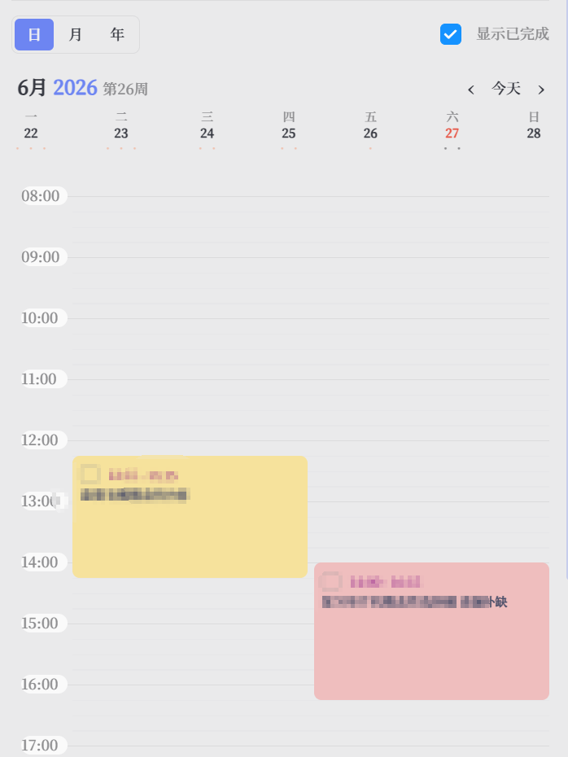
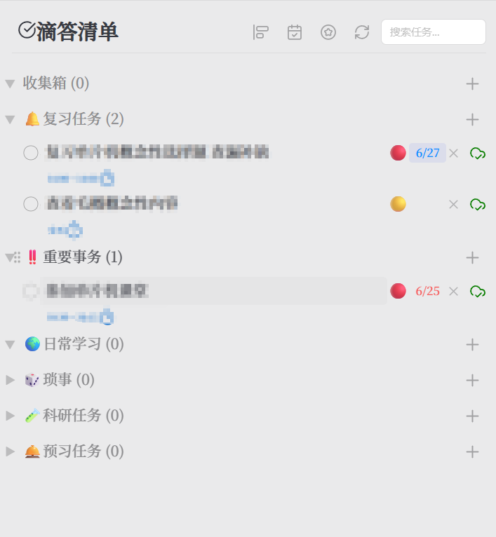
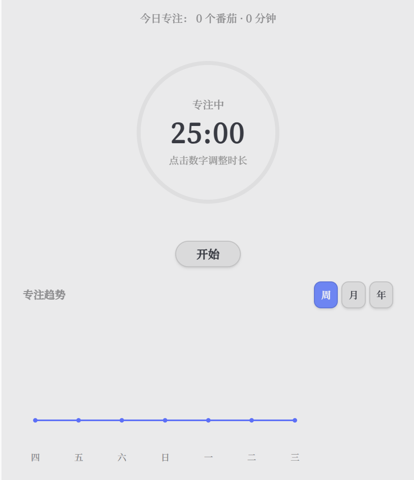
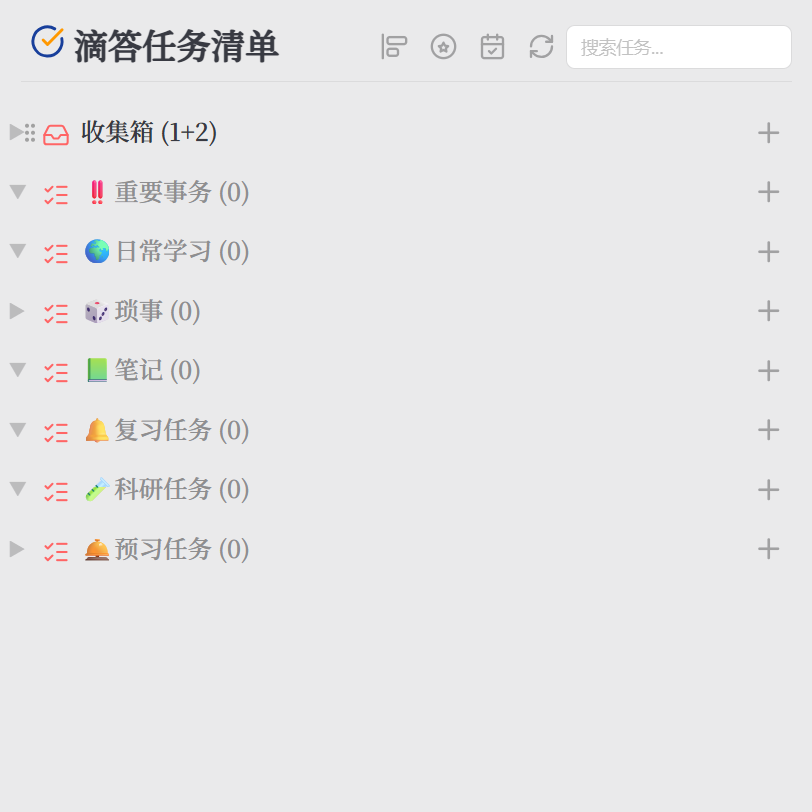
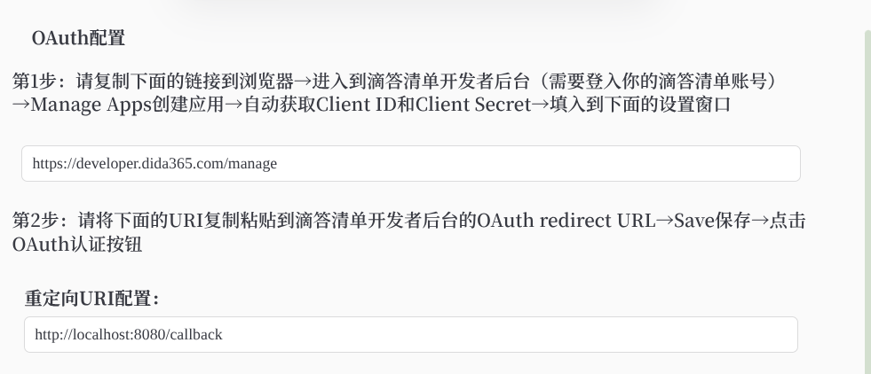
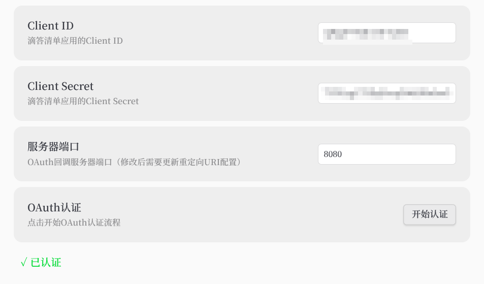
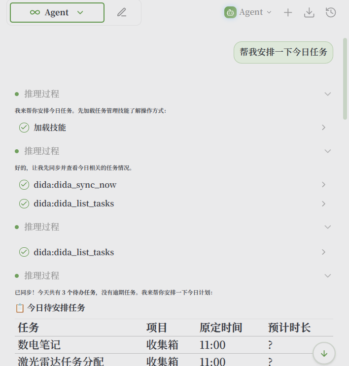
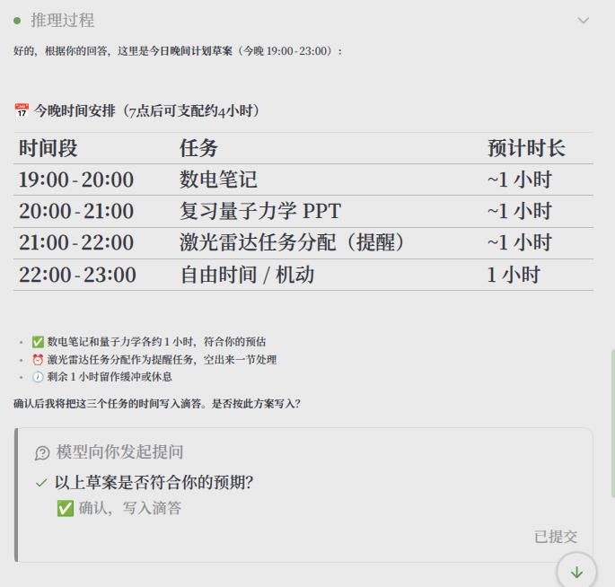
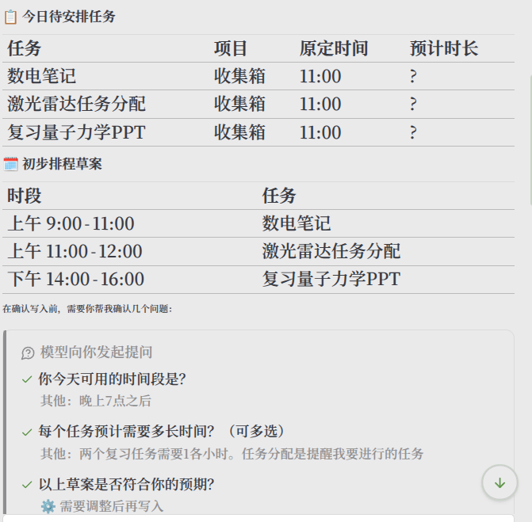
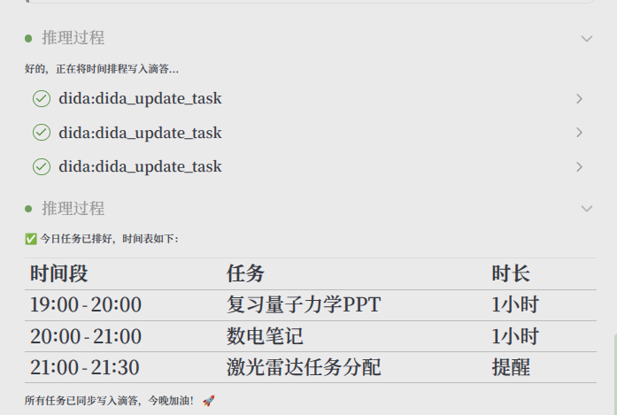

<h1 align="center">DidaSync</h1>

<p align="center"><b>Obsidian 与滴答清单 / TickTick 的任务双向同步插件。</b></p>

<p align="center">

一个将 Dida365 或 TickTick 任务带入 Obsidian 的任务同步插件，提供时间线、时间块、番茄钟和侧边栏管理视图。

</p>

<p align="center"><a href="https://github.com/CYZice/Obsidian-DidaSync/stargazers">


</a>

<a href="https://github.com/CYZice/Obsidian-DidaSync/releases/latest">


</a>

<a href="https://github.com/CYZice/Obsidian-DidaSync/releases">


</a>

<a href="https://github.com/CYZice/Obsidian-DidaSync/blob/main/LICENSE">


</a>

</p>

<p align="center">

<a href="./README.md">English</a> | <b>简体中文</b>

</p>

## 亮点

### 🔄 双向同步

DidaSync 让你的任务在 Obsidian 与 Dida365 或 TickTick 之间保持同步。

| 原生任务同步 | 快速创建任务 |
|:--:|:--:|
|  |  |
| 将 Dida365 或 TickTick 任务直接同步到笔记中，保留状态与详情。 | 通过专用命令和弹窗，在 Obsidian 内快速创建任务。 |

### 📅 可视化任务管理

| 时间块视图 | 时间线视图 | 侧边栏视图 |
|:--:|:--:|:--:|
|  |  |  |
| 以日历风格的时间块视图展示当天任务。 | 通过垂直时间线跟踪进度和截止时间。 | 直接在 Obsidian 侧边栏管理完整的 Dida365 / TickTick 任务列表。 |

### 🍅 番茄钟 + 📁 项目目录

| 番茄钟视图 | 项目目录 |
|:--:|:--:|
|  |  |
| 面向专注工作的番茄钟任务视图，支持计时和专注追踪。 | 支持创建、重命名、删除项目并自定义图标。 |

### 🤖 MCP / AI 插件集成

DidaSync 可在桌面端暴露本地 HTTP MCP 服务，让兼容 MCP 的 AI 工具安全访问你的任务。

| 能力 | 描述 |
|---------|-------------|
| 本地 MCP 服务 | 监听 `127.0.0.1`，默认关闭，可在设置中启用。 |
| Token 鉴权 | 使用你配置的 token 保护本地任务读写操作。 |
| AI 工具访问 | 支持列出、读取、搜索、新建、更新、排程、完成、删除和同步任务，以及项目访问。 |

### 🔐 官方 OAuth 2.0 — 无需密码

DidaSync 通过官方 OAuth 2.0 流程连接，直接在 Dida365/TickTick 页面授权，插件从不接触你的账号密码。

| OAuth 配置 | 授权完成 |
|:--:|:--:|
|  |  |
| 填写 Client ID 和 Secret，设置回调端口，点击 **开始认证**。 | 授权成功后 Token 本地存储，开始同步任务。 |

## 功能特性

| 功能 | 描述 | 使用方式 |
|---------|-------------|-------------|
| 🔄 **双向同步** | 在 Obsidian 与 Dida365 或 TickTick 之间同步任务状态、内容和详情。 | 完成 OAuth 后，可从侧边栏或设置中执行同步。 |
| 🗓️ **多种视图** | 提供时间块、时间线、侧边栏任务列表和番茄钟视图。 | 从侧边栏、命令或视图入口打开。 |
| ⚡ **创建 / 插入任务** | 在项目中创建任务，或从编辑器插入并关联已有 Dida 任务。 | 使用命令，或通过 Obsidian 原生任务语法创建。 |
| 📝 **任务详情 / 检查项 / 子任务** | 编辑任务标题、备注、检查项和子任务，并同步回远端。 | 在任务列表中打开任务详情。 |
| 🔁 **循环任务支持** | 同步并管理复杂的循环任务。 | 正常同步后即可查看和勾选循环任务。 |
| 🍅 **番茄钟视图** | 面向专注工作的时间块视图，支持计时和专注追踪。 | 在插件内部切换到番茄钟视图。 |
| ✋ **拖拽排程** | 在时间视图和时间块视图中拖拽全天任务进行排程。 | 在支持的视图中直接拖拽任务。 |
| ↔️ **跨项目拖拽移动** | 在侧边栏任务列表中通过拖拽移动任务到其他项目。 | 将任务拖到目标项目标题或容器。 |
| ✅ **已完成任务视图** | 独立查看已完成任务，按时间范围筛选，并支持恢复。 | 在任务列表筛选菜单中打开 `已完成任务`。 |
| 📋 **拖拽到 Markdown** | 将任务拖入 Markdown 编辑器，插入带链接的复选框项。 | 见 [拖拽任务到 Markdown 文档](#拖拽任务到-markdown-文档)。 |
| 🔗 **Markdown 回跳链接** | 从笔记中的 Dida 链接跳回 Obsidian 内对应任务。 | 点击笔记里的 `obsidian://dida-task` 链接。 |
| 📝 **任务同步到笔记** | 将某日、某周、某月、某年或自定义时间段的任务汇总写入笔记。 | 见 [同步任务到笔记](#同步任务到笔记)。 |
| 🤖 **MCP / AI 集成** | 暴露本地 MCP 服务，供 AI 插件操作 Dida 任务。 | 见 [MCP / AI 插件使用](#mcp--ai-插件使用)。 |

## 快速开始

1. [安装并启用插件](#安装)。
2. 在插件设置中点击 **Authorize** 按钮启动官方 OAuth 流程，页面会跳转到 Dida365 或 TickTick 的授权页面，直接在此授权，无需输入账号密码。
3. 打开侧边栏或使用功能区图标开始同步任务。

## 常见工作流

### 查看并恢复已完成任务

1. 打开侧边栏任务列表顶部搜索框中的筛选菜单。
2. 点击 `已完成任务`。
3. 在弹窗中选择开始日期和结束日期。
4. 点击 `查询` 获取该时间范围内的已完成任务。
5. 点击任意任务右侧的 `恢复` 将其标记为未完成。

### 同步任务到笔记

1. 打开 **设置 -> DidaSync -> 同步设置 -> 任务同步到笔记设置**。
2. 设置写入区块、笔记保存位置、周起始日和是否查询远端任务。
3. 打开命令面板并运行 `同步任务到笔记`。
4. 在弹窗中选择某日、某周、某月、某年或自定义时间段。
5. DidaSync 会将该时间段内的任务写入同名笔记；也可以开启“每次生成新笔记”来创建独立汇总文件。

### 使用 Obsidian 原生任务语法 `- [ ]`

1. 启用 **设置 -> DidaSync -> 同步设置 -> 启用原生任务同步**。
2. 在 Markdown 文档中输入 `- [ ] ` 等原生任务语法。
3. DidaSync 检测到该模式后会弹出操作菜单。
4. 选择是否将该任务同步到 Dida365 或 TickTick，或继续补充日期等信息。
5. 同步后，任务行会追加 Dida 链接；之后勾选 `- [x]` 也可联动更新远端状态。

如果你偏好键盘流，可以运行 `插入/创建滴答任务` 命令打开任务建议与创建入口。

### 拖拽任务到 Markdown 文档

你可以将侧边栏任务列表中的任务直接拖入任意 Obsidian 编辑器：

1. 在侧边栏找到目标任务。
2. 将其拖到 Markdown 文档中。
3. DidaSync 会插入一行原生 Obsidian 任务并附带 Dida 链接，例如：

```md
- [ ] 数电笔记 [🔗Dida](obsidian://dida-task?didaId=xxxx) 📅 2026-05-25
```

这样既可以在笔记中勾选任务，也可以通过链接跳回对应的 Dida 任务。

## OAuth 认证

DidaSync 采用官方 OAuth 2.0 流程，在 Dida365/TickTick 页面直接授权，Token 本地存储，插件从不接触用户名或密码。回调仅在 localhost 运行，不会暴露到网络。

## OAuth 排查

插件内置 OAuth 授权。如果授权失败，优先检查以下几项：

1. 确认网络连接正常。
2. 如果当前网络环境访问 Dida 授权页不稳定，尝试切换代理或 VPN 状态后重试。
3. 检查本地 `8080` 端口是否已被占用。
4. 如果你在插件设置中修改了 OAuth 回调端口，也要同步更新 Dida 开发者后台中的 redirect URL。

如果 `8080` 端口被占用，本地 OAuth 回调服务通常无法启动。这种情况下，请将 **设置 -> DidaSync -> OAuth 设置 -> 服务器端口** 改为其他可用端口，再更新 redirect URL 后重试。

## MCP / AI 插件使用

启用 **设置 -> DidaSync -> 高级/重置 -> MCP 服务** 后，可将以下配置添加到兼容 MCP 的 AI 插件中：

```json
{
  "transport": "http",
  "url": "http://127.0.0.1:35829/mcp",
  "headers": {
    "Authorization": "Bearer <DIDASYNC_MCP_TOKEN>"
  }
}
```

### 1.4.x MCP 工具

1.4.x 版本引入并扩展了本地 HTTP MCP 服务，目前暴露了 12 个可供 AI 直接调用的工具：

| 分类 | 工具 |
|---------|-------------|
| 读取 | `dida_list_tasks`, `dida_get_task`, `dida_search_tasks`, `dida_list_projects`, `dida_list_completed_tasks` |
| 写入 | `dida_create_task`, `dida_update_task`, `dida_schedule_tasks`, `dida_complete_task`, `dida_delete_task`, `dida_move_task` |
| 同步 | `dida_sync_now` |

- `dida_list_tasks` 仅返回未完成任务。
- `dida_list_completed_tasks` 仅返回已完成任务，并支持时间范围筛选。
- `dida_move_task` 专门用于跨项目移动任务。

### YOLO MCP 工作流示例

下面展示 YOLO 风格 Agent 如何通过 DidaSync MCP 读取、规划、确认并写回今天的任务：

| 步骤 | MCP 工作流 |
|---------|-------------|
| 1. 读取并同步 | Agent 先执行 `dida_sync_now`，再调用 `dida_list_tasks`，识别仍需安排的任务。 |
| 2. 生成草案 | 根据可用时间和预期时长，Agent 先给出排程草案，而不是立即写回。 |
| 3. 用户确认 | 用户确认后，Agent 将晚间时间块整理成可执行计划。 |
| 4. 写回任务 | Agent 连续调用 `dida_update_task`，将确认后的排程写回 Dida365 或 TickTick。 |

| 读取任务并生成草案 | 确认后写回 |
|:--:|:--:|
|  |  |
| Agent 读取今日任务并准备排程草案。 | Agent 在收到明确确认前不会直接写回。 |

| 草案排程 | 最终结果 |
|:--:|:--:|
|  |  |
| Agent 根据可用时间、任务时长和优先级提出时间块方案。 | Agent 将排程写回，并显示最终同步后的任务时段。 |

## 安装

### 官方插件市场安装

1. 打开 Obsidian 的 `设置 -> 第三方插件`。
2. 如有需要，先关闭 `安全模式`，然后点击 `浏览`。
3. 搜索 `DidaSync`。
4. 点击 `安装`，然后启用插件。

### 手动安装

1. 从 [Releases](https://github.com/CYZice/Obsidian-DidaSync/releases) 下载最新的 `main.js`、`manifest.json` 和 `styles.css`。
2. 创建目录 `<vault>/.obsidian/plugins/didasync/`。
3. 将文件复制到该目录，并在 Obsidian 设置中启用插件。

## 发布与隐私说明

- DidaSync 通过 **官方 OAuth 2.0** 连接 — 插件从不要求也不存储用户名或密码。
- 插件会访问官方 Dida365 或 TickTick API 以读取、创建、更新、完成、删除、移动和同步任务。
- 插件不上传遥测数据，也不包含广告。
- 启用 MCP 服务后，插件会在本机 `127.0.0.1` 上启动本地 HTTP 服务，并使用你配置的 token 进行鉴权。
- OAuth token、MCP token 和插件设置都通过 Obsidian 的插件数据存储机制保存在本地。

## 支持

如果 DidaSync 对你有帮助，可以为仓库点个 Star，或提交 Issue 帮助改进。

<p align="center">

<a href="https://github.com/CYZice/Obsidian-DidaSync/issues" target="_blank">

</a>

</p>

## 许可证

[MIT License](LICENSE)
